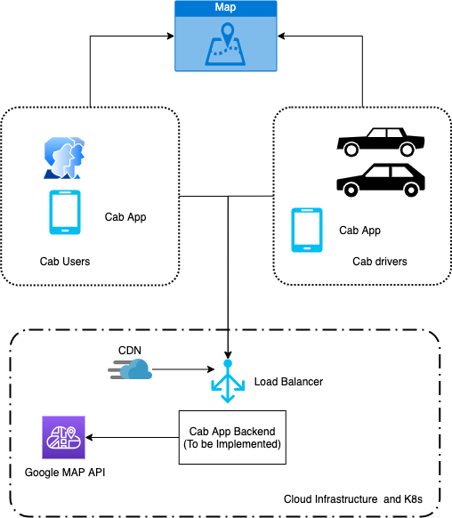
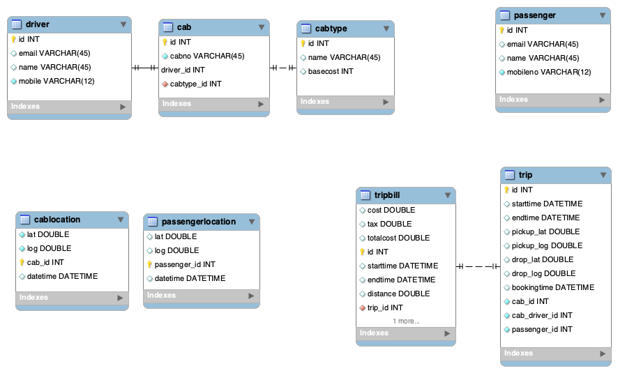
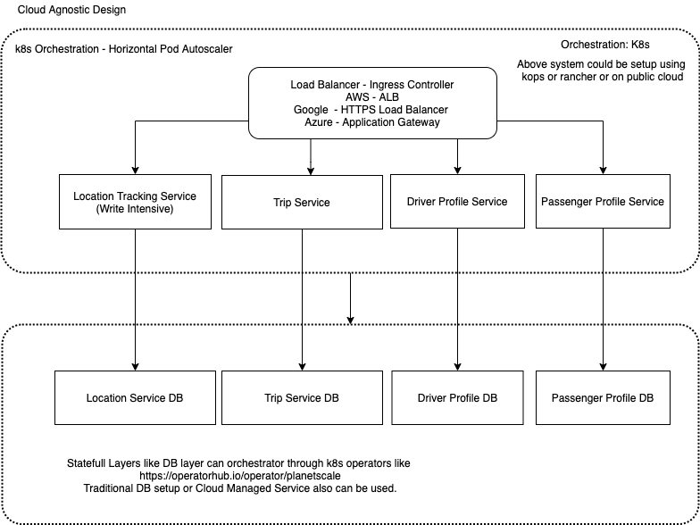

# Uber/Ola Application

Index

1. Requirements
2. Understanding the Scale
3. C4 - System Design
4. C4 - Component Design
5. C4 - Code Design

## 1. Requirements

#### Business requirements

* A user should be able to request a booking for a cab from pickup location A to pickup location B
* A user should be able to view his past bookings
* A user should be able to get cabs that are nearby.


#### Stakeholders
1. Passenger
2. Cab Driver

#### User Stories
We consider screens just to understand stakeholders requirements and user flows.

* Passenger
  1. Booking_screen_unbooked:
     1. Able to set the Pick up and drop location using map with validation.
     2. Select the Cab Type and Booking Time.
     3. Internally After booking is confirmed select the nearest cab.
  2. Booking_screen_booked:
     1. With Pick up and drop location. Cab Driver Details.
  3. Profile_rides:
     1.  Display list of past rides. Reverse Sorted by date and paginated based on time/date.
  4. Profile_user: Display User Details

* Cab Driver
  1. Booking_screen_booked:
     1. Display user pickup and drop location with user details.

### Assumptions

1. Geocoding and reverse gecoding is handled by another mapping system like google. Lat/Log are only stored in the db.
2. User login/signup, Cab Registration and Emergency alarms are not handled.
3. We are building only API System in golang.
4. We don't handle cases hot areas.
5. Car Pools are not handled.
6. Post Trip Processing to collect updates and feedback is not handled.
7. Geospartial index optimzation is low priority.

### References
https://www.infoq.com/presentations/uber-market-platform/
http://highscalability.com/blog/2015/9/14/how-uber-scales-their-real-time-market-platform.html


## Understanding the Scale

**How many people would access it ?**

```
With about 150 million users availing more than 2 million rides on its platform each day, Ola is sitting on a mountain of data about its users’ financial power and spends
```
Let us assume the below details based on [tech news](https://techcrunch.com/2019/05/15/indias-ride-hailing-firm-ola-is-now-in-the-credit-card-business-too/#:~:text=With%20about%20150%20million%20users,users'%20financial%20power%20and%20spends)

**Bookings per day: 2 million**
**Rides per day: 2 million**

#### Back-of-the-envelope calculations

Rides are not alone the data updates.
Let us assume we have 1 million drivers.
Driver and User location needs to be updated continously. Let us assume updates are sent every 4 second.

GPS Write per second: 1,000,000/4 = 250,000.

Rides booked Writes: 2,000,000 / (60*24*60) = 23

Ride Booking Reads: Really depends on the algorithm how we selected the driver.

We can assume the system is write intensive because there are gonna be GPS updates more frequent then other operations.

Average Writes Per Second
Writes = 250,000

Assume we are using horizontal scaling and each system has 100 QPS.

We would need around 2500 systems minium.
If we are using Cloud based architecture, we should min of 2500 systems and scale on demand for more load and spikes.

### CAP theorem

Consitency in GPS updates can be scarified a little based on approximations usually done on GPS.

But for bussiness availability is more important. Thus we should design AP system according to CAP theorem.


## 3. C4 - System Design



## 4. C4 - Component Design

### Entities
1. Passenger
2. Cab Driver
3. Cab Type
4. Cab
5. Trip
6. Trip Bill
7. Cab Driver Location.
8. Passenger Location.

### Relations
Cab has a Cab Type. n-1
Cab Driver owns Cab. 1-1
Passenger books Trips. 1-n
Cab has location. 1-1
Passenger has location. 1-1
Trip has one Passenger Assigned. 1-1
Trip has one Cab Driver Assigned. 1-1

### DB Schema



### Component Design



## 5. C4 - Code Design
